# hosts修改、注册无法正常送信解决方法

## 目录
+ 注意事项
+ hosts修改教程
+ 检查是否生效
+ 注册无法正常送信解决方法

## 注意事项
1.	修改hosts不一定保证能正常访问网站；能访问，也很有可能速度很慢。
2.	服务器ip会变动，修改hosts文件不是一劳永逸的解决方法，假如哪天不能访问了，可以重新修改hosts文件，用最新的ip替换。

## hosts修改教程
1.	首先找到hosts文件，路径是 C:\Windows\System32\drivers\etc  
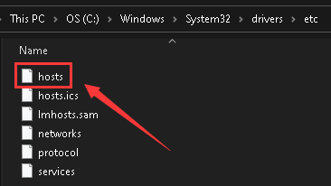
2.	打开hosts文件，右键选择用记事本打开。  
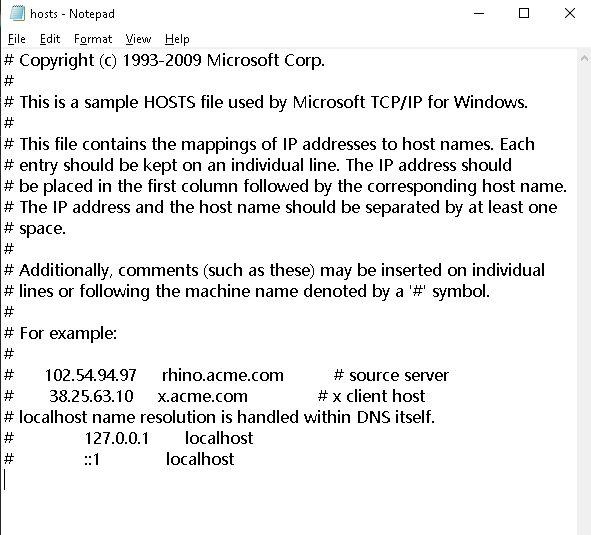
3.	打开网站 cssxsh.github.io 。复制里面的内容。  
    因为网络不稳定，该网站可能无法正常访问，可以过段时间再看，或者找能访问的群友发给你网站内容。  
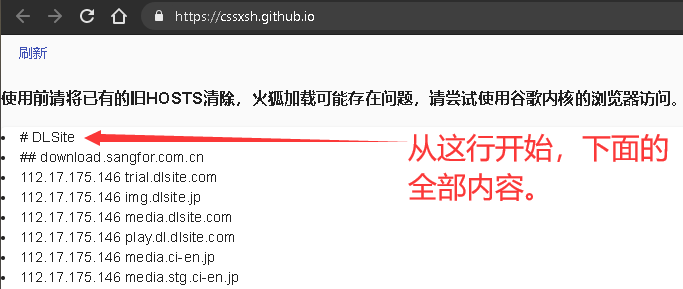
4.	粘贴到hosts文件中。在文件原有内容下面粘贴即可。最后保存。  
假如是重新修改hosts文件，记得替换掉以前的内容。  
假如没有权限，请百度搜索：hosts、没有权限等关键词，自行解决。  
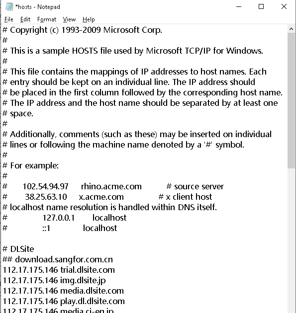
5.	如 www.dlsite.com 网址依然无法访问，请多刷新几次，重启浏览器，或尝试以下网址:  
www.dlsite.com/index.html  
www.dlsite.com/home/  
www.dlsite.com/maniax/  

## 检查是否生效
修改hosts后，依然无法打开网站，可以按照下面的步骤检查一下。
1.	打开cmd。在电脑左下角的搜索中输入 cmd ，然后按回车(Enter)。  
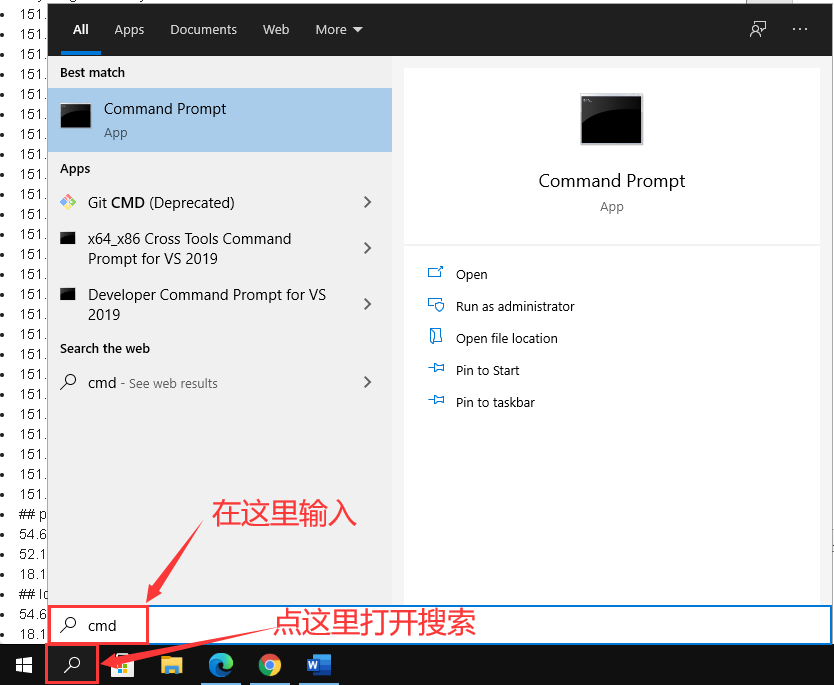
2.	输入指令运行。在打开的窗口中输入 ping www.dlsite.com ，然后按回车运行命令，等待运行结果。  
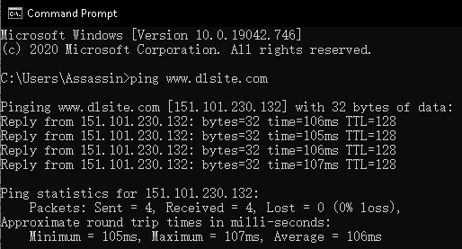
3.	查看结果  
如果连接失败，结果应该会是这样（会有4行超时）:  
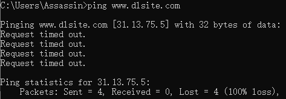  
如果连接成功，结果应该会是这样:  
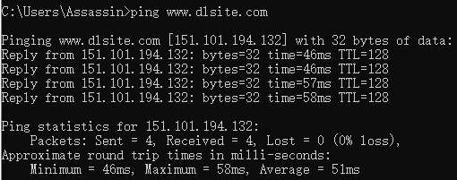
4.	查看IP地址。假如连接失败，看一下IP地址是多少。  
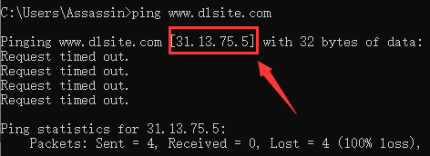
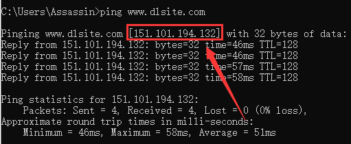
5.	对比IP地址  
查看网站 cssxsh.github.io 中带有 www.dlsite.com 的行。  
（可以在浏览器中按Ctrl + F，输入www.dlsite.com搜索）  
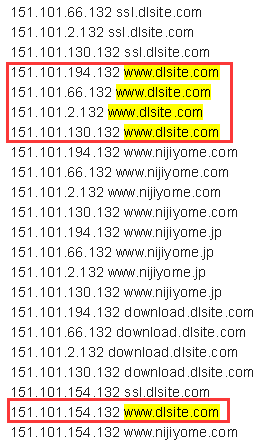  
看一下上面命令的运行结果中的IP地址是否与网页上的有相同的。如果有相同的IP地址，那说明hosts的修改已经生效，是其他原因导致的问题。如网站上提供的hosts信息已经过时等等。  
本例中，在成功的情况下，命令运行结果中的IP是151.101.194.132，与网页上含有www.dlsite.com的第一行的IP相同。  
（⚠注意，本文截图中的信息已经过时，请查看最新的网页上的信息来对比）  
提问时最好带上hosts文件内容截图和ping www.dlsite.com命令运行结果的截图。  

## 注册无法正常送信解决方法
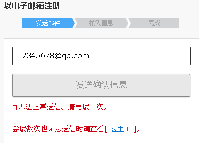  
造成这个问题的原因是DLsite使用了 www.google.com/recaptcha 的API，在国内无法正常访问。  
下面介绍Chrome和Edge这2个浏览器中的解决方法。
### Chrome
1.	下载Gooreplacer插件  
[点击这里下载](https://github.com/Shi-Iho/DLsite_hosts_guide/raw/master/crx/Gooreplacer_3.12.1.crx)
2.	打开Chrome扩展程序界面  
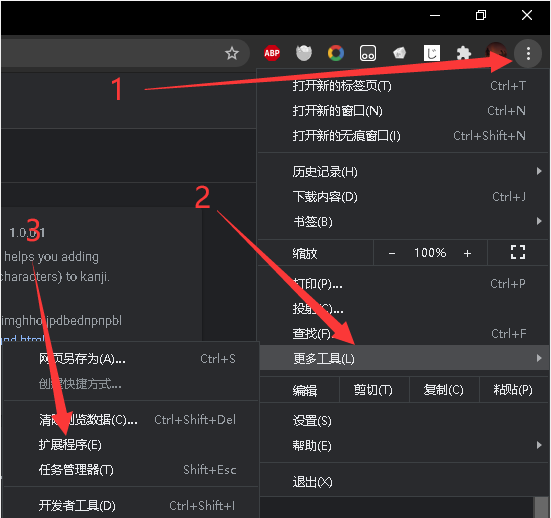  
3.	打开右上角的开发者模式  
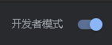  
4.	把crx文件拖到页面中，点击添加扩展程序。  
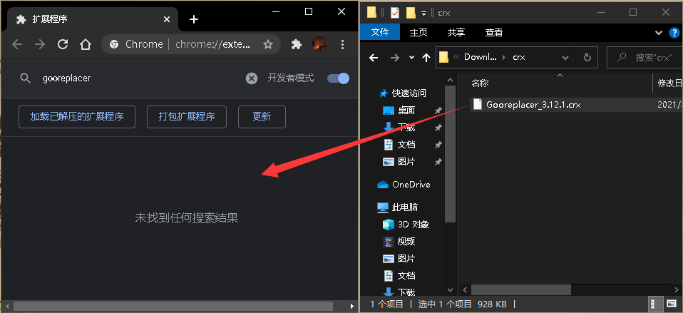 
5.	打开插件设置界面  
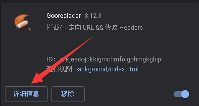
 
6.	添加重定向规则  
    1. 点击重定向、新增
    2. 在匹配规则中填写 www.google.com/recaptcha
    3. 在目标地址中填写 recaptcha.net/recaptcha
    4. 点击提交  
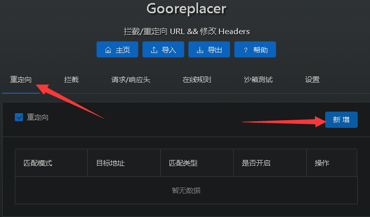
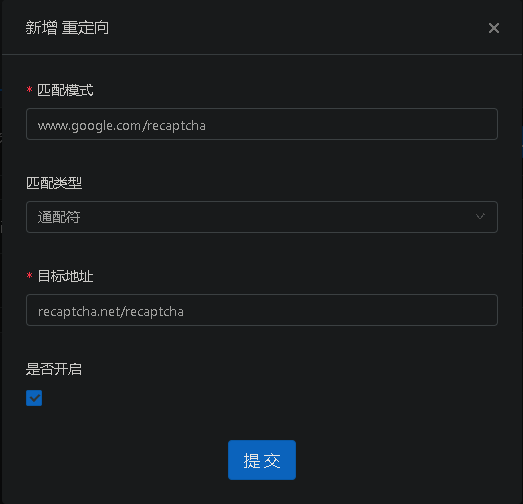
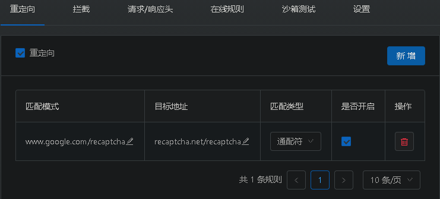
7. 关闭插件页面，刷新注册页面  

### Edge
此部分内容由 [cssxsh](https://github.com/cssxsh) 提供。  
1.	首先 edge 的版本，要尽量选择新版。 edge://settings/help
2.	打开 microsoftedge.microsoft.com/addons/Microsoft-Edge-Extensions-Home?hl=zh-CN
3.	搜索 googlereplacer
4.	点击获取  
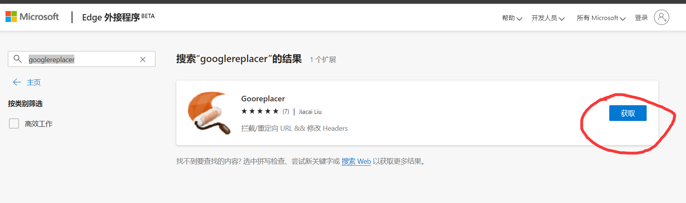
1. 选择添加扩展  
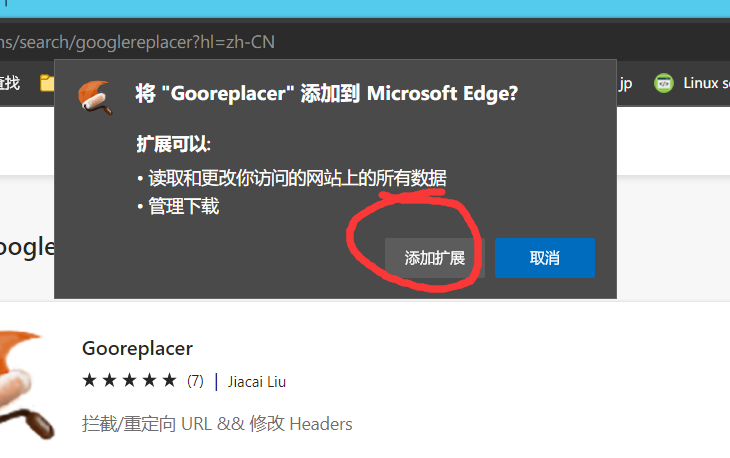
6. 点击配置规则，之后看Chrome的第6步  
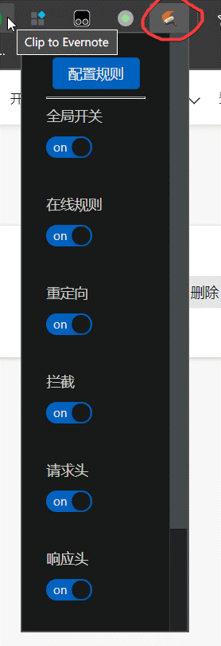